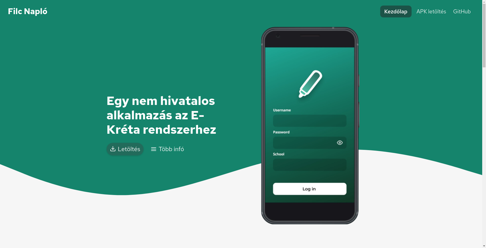

# A Filc Napló weboldalának forrása

<br>

# Filc API

### Base: `https://filcnaplo.hu/v2`

## Schools API

**GET** `/school_list.json`

Example response:

```json
[
  {
    "instituteCode": "example",
    "name": "Example School",
    "city": "Budapest"
  }
]
```

## News API

**GET** `/news.json`

Example response:

```json
[
  {
    "title": "Example",
    "content": "This is an example news.",
    "link": "https://example.com/",
    "open_label": "install",
    "platform": "android|ios|linux|windows|macos",
    "emergency": true
  }
]
```

## Supporters API

**GET** `/supporters.json`

Example response:

```json
{
  "progress": {
    "value": 50,
    "max": 100
  },
  "top": [
    {
      "name": "example",
      "amount": "$50",
      "platform": "donate"
    }
  ],
  "all": [
    {
      "name": "example 2",
      "amount": "$5",
      "platform": "patreon"
    },
  ]
}
```
